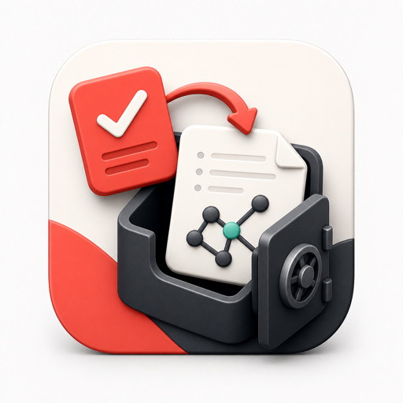

# todoist-to-obsidian

<p align="center">
  
</p>

A local-first bridge that imports Todoist capture tasks into Markdown notes in an Obsidian vault.

## Install

macOS/Linux:

```sh
curl -fsSL https://raw.githubusercontent.com/thefirebanks/todoist-to-obsidian/main/install.sh | sh
```

Windows PowerShell:

```powershell
irm https://raw.githubusercontent.com/thefirebanks/todoist-to-obsidian/main/install.ps1 | iex
```

Python users:

```sh
pipx install git+https://github.com/thefirebanks/todoist-to-obsidian.git
```

## Setup

In Todoist, create a project named `obs`. If you prefer a different project name, use that name when `todoist-to-obsidian init` asks which Todoist project to import from.

```sh
todoist-to-obsidian init
```

The setup command asks for your Todoist token, Todoist project, vault path, default note, aliases, and writes local config. The token is stored locally in the app config directory, not in the public config file.

## Run

```sh
todoist-to-obsidian run
```

Preview without writing or closing tasks:

```sh
todoist-to-obsidian run --dry-run
```

## Raycast Capture

Install Raycast's Todoist extension and use Todoist Quick Add as the capture box. Add tasks to your capture project with `#obs`, then let `todoist-to-obsidian` import them on the next scheduled run.

Examples:

```text
remember to send launch notes #obs
ideas: try a shorter onboarding flow #obs
project: follow up on vendor contract #obs
```

In these examples, `ideas:` and `project:` are aliases from your config. Captures without an alias prefix go to the default note.

If you configured a different Todoist project, replace `#obs` with that project selector. If you configured a Todoist label filter instead, use Todoist's label syntax, such as `@capture`.

## Schedule

Run every hour:

```sh
todoist-to-obsidian schedule install --every 1h
```

Run daily at 21:30 local time:

```sh
todoist-to-obsidian schedule install --daily-at 21:30
```

Supported interval formats are `15m`, `30m`, `1h`, `6h`, and `24h`.

## Routing

Captures without an alias prefix go to the configured default note.

Given this config:

```toml
[aliases]
project = "Projects/project notes.md"
ideas = "Notes/ideas.md"
```

This Todoist task:

```text
project: follow up on the launch checklist
```

appends to:

```text
Projects/project notes.md
```

Alias paths are relative to the Obsidian vault root. If an alias target is missing, the bridge falls back to the default note and prints a warning.

## Config

Show the default config path:

```sh
todoist-to-obsidian config path
```

See [examples/config.example.toml](examples/config.example.toml).

## Security

- Todoist tokens are stored locally in a private `.env` file, not in `config.toml`.
- On macOS/Linux, the bridge refuses to load `.env` if group/other permissions are enabled.
- Note paths are constrained to stay inside the configured Obsidian vault.
- The package has no runtime dependencies.
- Install scripts are optional; inspect them before running if you prefer not to pipe remote scripts into a shell.

## Development

```sh
python -m unittest discover -s tests
```

## License

MIT
